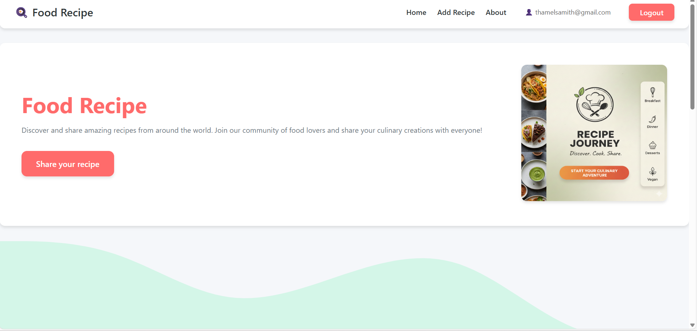
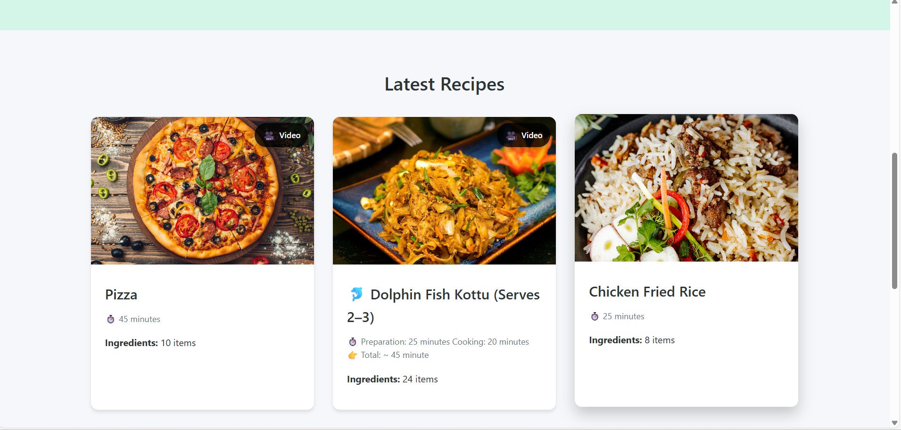
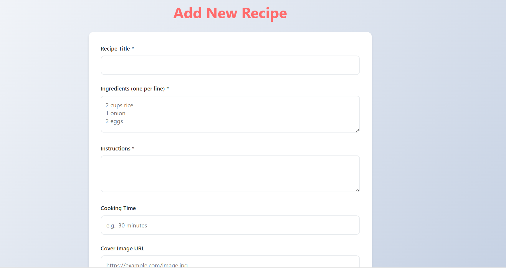
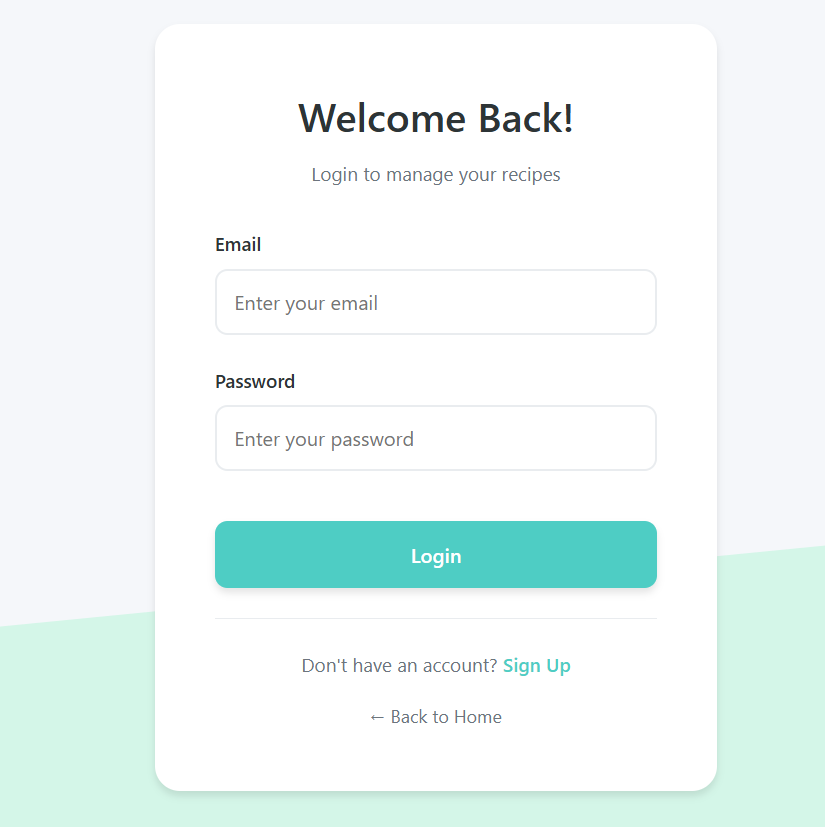
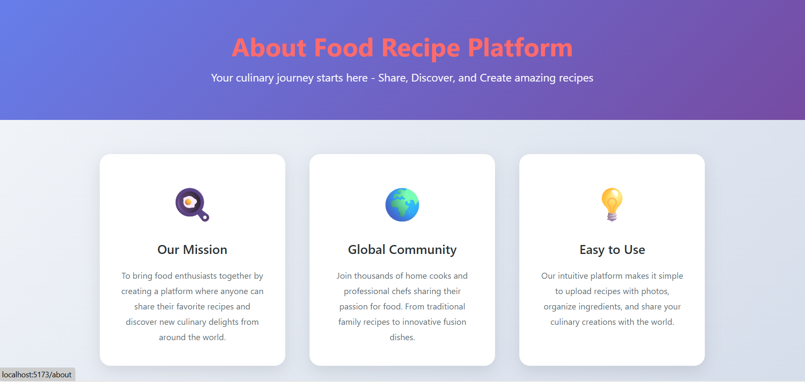

# 🍳 Food Recipe Platform

A full-stack MERN (MongoDB, Express.js, React, Node.js) application for sharing and discovering delicious recipes from around the world. Users can create, edit, delete, and browse recipes with photos and videos.

## ✨ Features

- 🔐 **User Authentication** - Secure JWT-based authentication and authorization
- 📝 **Recipe Management** - Create, read, update, and delete recipes
- 📸 **Photo Upload** - Upload recipe cover images
- 🎥 **Video Support** - Add cooking video tutorials to recipes
- 📱 **Fully Responsive** - Works seamlessly on desktop, tablet, and mobile devices
- 🔍 **Recipe Discovery** - Browse all recipes on the home page
- 👤 **User Profiles** - Track recipes created by specific users
- 🎨 **Modern UI/UX** - Clean, intuitive interface with smooth animations
- ⏱️ **Cooking Time Display** - See preparation time for each recipe
- 📋 **Ingredient Lists** - Organized ingredient listings
- 📖 **Step-by-Step Instructions** - Detailed cooking instructions

## 🖼️ Interface Screenshots

### Home Page

*Browse all recipes with beautiful card layouts and video indicators*

### Recipe Details

*View detailed recipe information including ingredients, instructions, and videos*

### Add Recipe

*Easy-to-use form for creating new recipes*

### Login/Register

*Secure authentication system*

### About Page

*Learn about the platform and its features*

---

> **Note:** Additional screenshots (Edit Recipe, Mobile View) can be added later. Follow the guide in `screenshots/HOW-TO-ADD-SCREENSHOTS.md` to add more images.

## 🛠️ Tech Stack

### Frontend
- **React** (v19.2.0) - UI library
- **React Router DOM** (v7.11.0) - Client-side routing
- **Axios** (v1.13.2) - HTTP requests
- **React Icons** (v5.5.0) - Icon library
- **Vite** (v7.2.4) - Build tool and dev server
- **CSS3** - Styling with modern features

### Backend
- **Node.js** - Runtime environment
- **Express.js** (v5.2.1) - Web framework
- **MongoDB** with **Mongoose** (v9.0.1) - Database
- **JWT** (jsonwebtoken v9.0.3) - Authentication
- **bcryptjs** (v3.0.3) - Password hashing
- **Multer** (v2.0.2) - File upload handling
- **CORS** - Cross-origin resource sharing
- **dotenv** (v17.2.3) - Environment variables

## 📋 Prerequisites

Before running this project, make sure you have:

- **Node.js** (v14 or higher)
- **MongoDB** (local installation or MongoDB Atlas account)
- **npm** or **yarn** package manager

## 🚀 Installation & Setup

### 1. Clone the Repository

```bash
git clone <your-repository-url>
cd "food recipe"
```

### 2. Backend Setup

```bash
# Navigate to Backend folder
cd Backend

# Install dependencies
npm install

# Create .env file in Backend folder with the following variables:
# MONGODB_URI=your_mongodb_connection_string
# JWT_SECRET=your_jwt_secret_key
# PORT=5000

# Start the backend server
npm run dev
```

The backend server will run on `http://localhost:5000`

### 3. Frontend Setup

```bash
# Open a new terminal and navigate to Frontend folder
cd Frontend/food-blog-app

# Install dependencies
npm install

# Start the development server
npm run dev
```

The frontend will run on `http://localhost:5173`

## 📁 Project Structure

```
food recipe/
├── Backend/
│   ├── config/
│   │   └── connectionDB.js          # Database configuration
│   ├── controller/
│   │   ├── recipe.js                # Recipe controllers
│   │   └── user.js                  # User controllers
│   ├── middleware/
│   │   └── auth.js                  # JWT authentication middleware
│   ├── models/
│   │   ├── recipe.js                # Recipe schema
│   │   └── user.js                  # User schema
│   ├── routers/
│   │   ├── recipe.js                # Recipe routes
│   │   └── user.js                  # User routes
│   ├── public/
│   │   ├── images/                  # Uploaded recipe images
│   │   └── videos/                  # Uploaded recipe videos
│   ├── server.js                    # Express server entry point
│   ├── package.json
│   └── .env                         # Environment variables
│
├── Frontend/
│   └── food-blog-app/
│       ├── public/                  # Static assets
│       ├── src/
│       │   ├── assets/              # Images and assets
│       │   ├── components/          # React components
│       │   │   ├── Footer.jsx
│       │   │   ├── InputForm.jsx
│       │   │   ├── MainNavigation.jsx
│       │   │   ├── Modal.jsx
│       │   │   ├── Navbar.jsx
│       │   │   └── RecipeItems.jsx
│       │   ├── pages/               # Page components
│       │   │   ├── About.jsx
│       │   │   ├── AddFoodRecipe.jsx
│       │   │   ├── EditRecipe.jsx
│       │   │   ├── Home.jsx
│       │   │   ├── Login.jsx
│       │   │   └── RecipeDetails.jsx
│       │   ├── styles/              # CSS files
│       │   │   └── Login.css
│       │   ├── App.css              # Global styles
│       │   ├── App.jsx              # Main App component
│       │   ├── index.css            # Base styles
│       │   └── main.jsx             # Entry point
│       ├── index.html
│       ├── package.json
│       └── vite.config.js
│
└── README.md
```

## 🔑 API Endpoints

### Authentication
- `POST /user/register` - Register new user
- `POST /user/login` - User login

### Recipes
- `GET /recipe` - Get all recipes
- `GET /recipe/:id` - Get single recipe by ID
- `POST /recipe` - Create new recipe (Auth required)
- `PUT /recipe/:id` - Update recipe (Auth required)
- `DELETE /recipe/:id` - Delete recipe (Auth required)
- `PATCH /recipe/:id/photo` - Upload recipe photo (Auth required)
- `PATCH /recipe/:id/video` - Upload recipe video (Auth required)

## 💡 Usage Guide

### Creating a Recipe

1. **Login/Register** - Create an account or login to your existing account
2. **Add Recipe** - Click on "Add Recipe" in the navigation
3. **Fill Details** - Enter recipe title, ingredients (one per line), instructions, and cooking time
4. **Upload Media** - Optionally add a cover image URL
5. **Submit** - Click "Add Recipe" to save

### Editing a Recipe

1. Navigate to the recipe details page
2. Click "Edit Recipe" button
3. Update any fields including uploading new photos or videos
4. Save changes

### Viewing Recipes

- **Home Page** - Browse all recipes with cover images
- **Video Indicator** - Recipes with videos show a 🎥 badge
- **Recipe Details** - Click any recipe card to view full details
- **Watch Videos** - Play cooking tutorial videos directly on the recipe page

## 🎨 Features in Detail

### Responsive Design
- **Mobile First** - Optimized for mobile devices with touch-friendly controls
- **Tablet Ready** - Adaptive layouts for medium-sized screens
- **Desktop Enhanced** - Multi-column layouts for larger screens
- **Breakpoints**: 480px, 768px, 1024px

### User Experience
- **Smooth Animations** - Card hover effects and transitions
- **Loading States** - Visual feedback during data fetching
- **Error Handling** - User-friendly error messages
- **Form Validation** - Client-side validation for all forms

### Security
- **JWT Authentication** - Secure token-based authentication
- **Password Hashing** - bcrypt encryption for user passwords
- **Protected Routes** - Middleware for route protection
- **CORS Configuration** - Secure cross-origin requests

## 🔧 Environment Variables

### Backend (.env)
```env
MONGODB_URI=mongodb://localhost:27017/food-recipe
JWT_SECRET=your_super_secret_jwt_key_here
PORT=5000
```

### Frontend
Update API base URL in axios requests if needed:
```javascript
http://localhost:5000
```

## 📱 Browser Support

- Chrome (recommended)
- Firefox
- Safari
- Edge
- Opera

## 🐛 Known Issues

- Large video files (>50MB) may take time to upload
- Image URLs must be accessible (CORS-enabled)

## 🚀 Future Enhancements

- [ ] Search and filter functionality
- [ ] Recipe categories and tags
- [ ] User ratings and reviews
- [ ] Social sharing features
- [ ] Favorite/bookmark recipes
- [ ] User profile pages
- [ ] Recipe difficulty levels
- [ ] Nutritional information
- [ ] Print recipe functionality
- [ ] Dark mode theme

## 🤝 Contributing

Contributions are welcome! Please follow these steps:

1. Fork the repository
2. Create a feature branch (`git checkout -b feature/AmazingFeature`)
3. Commit your changes (`git commit -m 'Add some AmazingFeature'`)
4. Push to the branch (`git push origin feature/AmazingFeature`)
5. Open a Pull Request

## 📄 License

This project is licensed under the MIT License - see the LICENSE file for details.

## 👥 Authors

- Samith Thamel - Initial work

## 🙏 Acknowledgments

- Recipe images from Unsplash
- Icons from React Icons
- UI inspiration from modern food blogs
- MongoDB for database solutions
- Vite for fast development experience

## 📞 Support

For support, email thamelsamith@gmail.com or open an issue in the repository.

## 🌟 Show Your Support

Give a ⭐️ if you like this project!

---

**Made with ❤️ and React**
